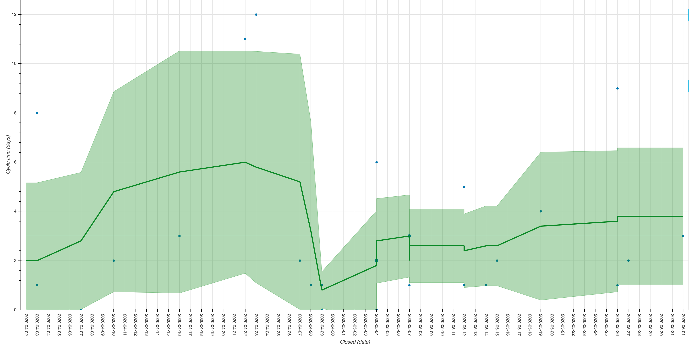
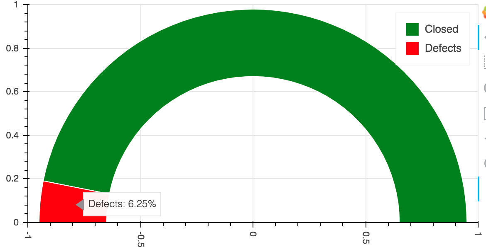

# Jira Ticket Analysis tools

A simple suite of tools that let us report on engineering KPIs out of Jira.

## Setup instructions

```
git clone git@github.com:hotjar/jira-analysis.git
python3 -m venv venv
. venv/bin/activation

python setup.py install
```

You need to configure your Jira credentials and project config. This is two files:

* `credentials.yaml` for Jira credentials
* `config.yaml` for your project config

### `credentials.yaml`

```yaml
jira_credentials:
    email: your_email@example.com
    token: JIRA_TOKEN
```

### `config.yaml`

Use this to set your In Progress and Done statuses for each project you want to analyse. This lets you handle customised
workflows to get the right charts.

```yaml
projects:
  PROJECT_KEY:
    key: PROJECT_KEY
    in_progress:
      - In Progress
      - Review
    completed:
      - Done
    analyse_issue_types:
      - Story
      - Bug
      - Experiment
```

You can configure multiple projects with different settings for In Progress and Completed. Simple add items to the list.

The `analyse_issue_types` config is optional: use it to set issue types that have fixed or deliberately short times e.g.
toil (that should take less than a day) or spikes (that are fixed lengths of time). This avoids messing up your cycle
time charts.

## Running

First you need to download tickets into a JSON file for analysis:

```
jira-analysis fetch <PROJECT_KEY> <PROJECT_KEY>.json -c credentials.yaml
```

Once this is done, you can analyse the tickets:

```bash
# Build a cycle time chart
jira-analysis cycle-time <PROJECT_KEY> <PROJECT_KEY>.json -c config.yaml
# Build a defect rate plot
jira-analysis defect-rate <PROJECT_KEY> <PROJECT_KEY>.json -c config.yaml
```

Note the `-c` argument that points to the `credentials.yaml` file you created for Jira and the `config.yaml` file for
analysis.

### Example output

#### Control chart



#### Defect rate chart



## Why?

Jira is ridiculously customisable, to the point where it doesn't always easily support the reporting that you need in
the format that you have. Most of the time, people resolve this by dumping data into Excel and building custom charts
and reports.

The purpose of this is to work directly with Jira's API, which gives a lot more rich data, allowing us to get the
reports we want with minimal manual exporting, copying and pasting.

## License

[MIT](./LICENSE)
